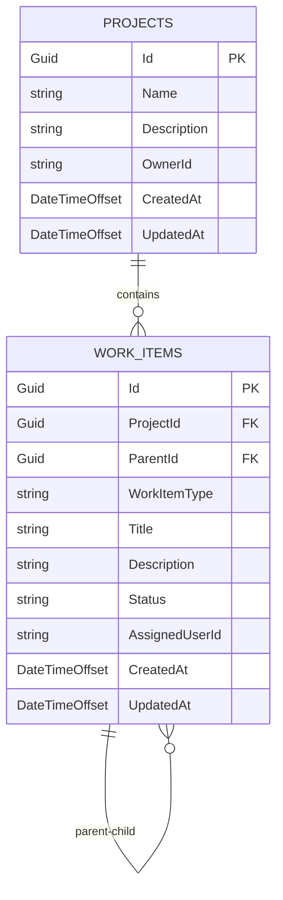

# Database Schema - AI TaskFlow MVP

## 1. Entities and Tables

### 1.1 Projects

**Table:** `projects`

| Column | Type | Constraints | Description |
|--------|------|-------------|-------------|
| Id | Guid | PRIMARY KEY | Strongly-typed ProjectId |
| Name | string(200) | NOT NULL | Project name |
| Description | string(2000) | NULL | Optional project description |
| OwnerId | string(256) | NOT NULL | Auth0 subject identifier |
| CreatedAt | DateTimeOffset | NOT NULL | Creation timestamp |
| UpdatedAt | DateTimeOffset | NOT NULL | Last update timestamp |

**C# Entity:**
```csharp
[StronglyTypedId(Template.Guid, "guid-efcore")]
public partial struct ProjectId {}

public sealed class Project
{
    public ProjectId Id { get; private set; }
    public string Name { get; private set; } = string.Empty;
    public string? Description { get; private set; }
    public string OwnerId { get; private set; } = string.Empty;
    public DateTimeOffset CreatedAt { get; private set; }
    public DateTimeOffset UpdatedAt { get; private set; }

    // Navigation
    public ICollection<WorkItem> WorkItems { get; private set; } = new List<WorkItem>();

    private Project() { } // EF Core

    public Project(ProjectId id, string name, string? description, string ownerId)
    {
        Id = id;
        Name = name;
        Description = description;
        OwnerId = ownerId;
        CreatedAt = DateTimeOffset.UtcNow;
        UpdatedAt = DateTimeOffset.UtcNow;
    }
}
```

---

### 1.2 WorkItems

**Table:** `work_items`

| Column | Type | Constraints | Description |
|--------|------|-------------|-------------|
| Id | Guid | PRIMARY KEY | Strongly-typed WorkItemId |
| ProjectId | Guid | NOT NULL, FK → projects.Id | Parent project reference |
| ParentId | Guid | NULL, FK → work_items.Id | Parent work item (null for Epics) |
| WorkItemType | string(50) | NOT NULL | Enum: Epic, Story, Task |
| Title | string(200) | NOT NULL | Work item title |
| Description | string(5000) | NULL | Optional detailed description |
| Status | string(50) | NOT NULL | Enum: New, Ready, InProgress, Done |
| AssignedUserId | string(256) | NULL | Auth0 subject of assigned user |
| CreatedAt | DateTimeOffset | NOT NULL | Creation timestamp |
| UpdatedAt | DateTimeOffset | NOT NULL | Last update timestamp |

**C# Entity:**
```csharp
[StronglyTypedId(Template.Guid, "guid-efcore")]
public partial struct WorkItemId {}

public enum WorkItemType
{
    Epic = 0,
    Story = 1,
    Task = 2
}

public enum WorkItemStatus
{
    New = 0,
    Ready = 1,
    InProgress = 2,
    Done = 3
}

public sealed class WorkItem
{
    public WorkItemId Id { get; private set; }
    public ProjectId ProjectId { get; private set; }
    public WorkItemId? ParentId { get; private set; }
    public WorkItemType WorkItemType { get; private set; }
    public string Title { get; private set; } = string.Empty;
    public string? Description { get; private set; }
    public WorkItemStatus Status { get; private set; }
    public string? AssignedUserId { get; private set; }
    public DateTimeOffset CreatedAt { get; private set; }
    public DateTimeOffset UpdatedAt { get; private set; }

    // Navigation
    public Project Project { get; private set; } = null!;
    public WorkItem? Parent { get; private set; }
    public ICollection<WorkItem> Children { get; private set; } = new List<WorkItem>();

    private WorkItem() { } // EF Core

    public WorkItem(
        WorkItemId id,
        ProjectId projectId,
        WorkItemId? parentId,
        WorkItemType workItemType,
        string title,
        string? description,
        string? assignedUserId)
    {
        Id = id;
        ProjectId = projectId;
        ParentId = parentId;
        WorkItemType = workItemType;
        Title = title;
        Description = description;
        Status = WorkItemStatus.New;
        AssignedUserId = assignedUserId;
        CreatedAt = DateTimeOffset.UtcNow;
        UpdatedAt = DateTimeOffset.UtcNow;
    }

    public void UpdateStatus(WorkItemStatus newStatus)
    {
        Status = newStatus;
        UpdatedAt = DateTimeOffset.UtcNow;
    }

    public void Assign(string userId)
    {
        AssignedUserId = userId;
        UpdatedAt = DateTimeOffset.UtcNow;
    }
}
```

---

## 2. Relationships

### 2.1 Projects → WorkItems (One-to-Many)

- **Cardinality:** One Project has many WorkItems
- **Foreign Key:** `work_items.ProjectId` → `projects.Id`
- **Delete Behavior:** CASCADE (deleting a project removes all its work items)
- **Navigation:**
  - Project.WorkItems (collection)
  - WorkItem.Project (reference)

### 2.2 WorkItems → WorkItems (Self-Referencing One-to-Many)

- **Cardinality:** One WorkItem (parent) has many WorkItems (children)
- **Foreign Key:** `work_items.ParentId` → `work_items.Id`
- **Delete Behavior:** CASCADE (deleting a parent removes all descendants recursively)
- **Navigation:**
  - WorkItem.Children (collection)
  - WorkItem.Parent (reference, nullable)
- **Hierarchy Rules (Application-Level Validation):**
  - **Epics:** `ParentId == null` AND `WorkItemType == Epic`
  - **Stories:** `Parent.WorkItemType == Epic` AND `WorkItemType == Story`
  - **Tasks:** `Parent.WorkItemType == Story` AND `WorkItemType == Task`

---

## 3. Indexes

**Initial Migration:** No indexes (per decision #9).

**Future Optimization Candidates:**
- `work_items.ProjectId` (for project filtering)
- `work_items.ParentId` (for hierarchy queries)
- `work_items.Status` (for Kanban board filtering)
- Composite: `(ProjectId, Status)` (for project-specific status queries)
- Composite: `(ParentId, Status)` (for progress calculation)

**Indexing Strategy:**
Add indexes based on actual query patterns and performance profiling during development. Monitor slow query logs and use PostgreSQL `EXPLAIN ANALYZE` before creating indexes.

---

## 4. DbContext

### 4.1 WorkItemsDatabaseContext

```csharp
using Microsoft.EntityFrameworkCore;

public sealed class WorkItemsDatabaseContext : DbContext
{
    public DbSet<Project> Projects => Set<Project>();
    public DbSet<WorkItem> WorkItems => Set<WorkItem>();

    public WorkItemsDatabaseContext(DbContextOptions<WorkItemsDatabaseContext> options) : base(options) { }

    protected override void OnModelCreating(ModelBuilder modelBuilder)
    {
        // Apply all IEntityTypeConfiguration<T> from assembly
        modelBuilder.ApplyConfigurationsFromAssembly(typeof(WorkItemsDatabaseContext).Assembly);
    }
}
```

### 4.2 Entity Configurations

**ProjectConfiguration.cs:**
```csharp
using Microsoft.EntityFrameworkCore;
using Microsoft.EntityFrameworkCore.Metadata.Builders;

public sealed class ProjectConfiguration : IEntityTypeConfiguration<Project>
{
    public void Configure(EntityTypeBuilder<Project> b)
    {
        b.ToTable("projects");

        // Primary Key
        b.HasKey(x => x.Id);
        b.Property(x => x.Id)
            .HasConversion(new ProjectId.EfCoreValueConverter())
            .ValueGeneratedNever();

        // Properties
        b.Property(x => x.Name)
            .IsRequired()
            .HasMaxLength(200);

        b.Property(x => x.Description)
            .HasMaxLength(2000);

        b.Property(x => x.OwnerId)
            .IsRequired()
            .HasMaxLength(256);

        b.Property(x => x.CreatedAt)
            .IsRequired();

        b.Property(x => x.UpdatedAt)
            .IsRequired();

        // Relationships
        b.HasMany(x => x.WorkItems)
            .WithOne(x => x.Project)
            .HasForeignKey(x => x.ProjectId)
            .OnDelete(DeleteBehavior.Cascade);

        // Concurrency
        b.Property<uint>("xmin")
            .IsRowVersion()
            .HasColumnType("xid");
    }
}
```

**WorkItemConfiguration.cs:**
```csharp
using Microsoft.EntityFrameworkCore;
using Microsoft.EntityFrameworkCore.Metadata.Builders;

public sealed class WorkItemConfiguration : IEntityTypeConfiguration<WorkItem>
{
    public void Configure(EntityTypeBuilder<WorkItem> b)
    {
        b.ToTable("work_items");

        // Primary Key
        b.HasKey(x => x.Id);
        b.Property(x => x.Id)
            .HasConversion(new WorkItemId.EfCoreValueConverter())
            .ValueGeneratedNever();

        // Foreign Keys
        b.Property(x => x.ProjectId)
            .IsRequired()
            .HasConversion(new ProjectId.EfCoreValueConverter());

        b.Property(x => x.ParentId)
            .HasConversion(new WorkItemId.EfCoreValueConverter());

        // Enums (stored as strings)
        b.Property(x => x.WorkItemType)
            .IsRequired()
            .HasConversion<string>()
            .HasMaxLength(50);

        b.Property(x => x.Status)
            .IsRequired()
            .HasConversion<string>()
            .HasMaxLength(50);

        // Properties
        b.Property(x => x.Title)
            .IsRequired()
            .HasMaxLength(200);

        b.Property(x => x.Description)
            .HasMaxLength(5000);

        b.Property(x => x.AssignedUserId)
            .HasMaxLength(256);

        b.Property(x => x.CreatedAt)
            .IsRequired();

        b.Property(x => x.UpdatedAt)
            .IsRequired();

        // Self-referencing relationship
        b.HasOne(x => x.Parent)
            .WithMany(x => x.Children)
            .HasForeignKey(x => x.ParentId)
            .OnDelete(DeleteBehavior.Cascade);

        // Concurrency
        b.Property<uint>("xmin")
            .IsRowVersion()
            .HasColumnType("xid");
    }
}
```

### 4.3 Registration (Program.cs)

```csharp
using Microsoft.EntityFrameworkCore;

var builder = WebApplication.CreateBuilder(args);

builder.Services.AddDbContext<WorkItemsDatabaseContext>(options =>
    options.UseNpgsql(
        builder.Configuration.GetConnectionString("DefaultConnection"),
        npgsql => npgsql.MigrationsAssembly("TaskFlow.Modules.WorkItems")
    )
    .UseQueryTrackingBehavior(QueryTrackingBehavior.NoTracking)
);

var app = builder.Build();
app.Run();
```

---

## 5. Design Decisions and Notes

### 5.1 Strongly-Typed IDs

Following `semantic-ids.md` conventions:
- **ProjectId** and **WorkItemId** use `StronglyTypedId` source generator
- Backing type: `Guid` (default)
- Templates: `"guid-efcore"` for EF Core value converters
- Serialization: IDs serialize as primitives in JSON (not nested objects)
- Benefits: Compile-time type safety, prevents ID confusion (e.g., passing ProjectId where WorkItemId expected)

### 5.2 Draft Tasks

**Decision:** No `IsDraft` column in database.
- AI-generated tasks remain **client-side only** until approved
- Frontend maintains draft state in memory/local storage
- Backend receives only approved tasks via dedicated endpoints
- Simplifies schema and avoids unnecessary persistence layer complexity

### 5.3 Hierarchy Enforcement

**Decision:** Application-level validation, no database constraints.
- Database allows flexible `ParentId` relationships
- Domain models and API validators enforce:
  - Epics: no parent (`ParentId == null`)
  - Stories: parent must be Epic
  - Tasks: parent must be Story
- Allows future flexibility without schema migrations

### 5.4 User Management

**Decision:** Store Auth0 subject IDs only, no Users table.
- `Projects.OwnerId` and `WorkItems.AssignedUserId` store Auth0 subject strings
- No local user profile storage in MVP
- Auth0 handles authentication; backend validates JWT tokens
- Simplifies schema and eliminates user sync complexity

### 5.5 Progress Tracking

**Decision:** On-the-fly calculation, no cached values.
- Query children by `ParentId` and aggregate by `Status`
- Calculate `CompletedCount` (where `Status == Done`) and `TotalCount`
- Manual refresh model eliminates need for real-time updates
- MVP scale (max 100 tasks per Epic) supports efficient aggregation

**Example Query (pseudo-code):**
```csharp
var progress = await context.WorkItems
    .Where(wi => wi.ParentId == parentId)
    .GroupBy(wi => 1)
    .Select(g => new {
        Total = g.Count(),
        Completed = g.Count(wi => wi.Status == WorkItemStatus.Done)
    })
    .FirstOrDefaultAsync();
```

### 5.6 Cascade Deletion

**Decision:** Database-level CASCADE configured in EF.
- `Projects → WorkItems`: Deleting project removes all work items
- `WorkItems → WorkItems`: Deleting parent removes all descendants
- User confirmation dialogs handled in **API layer** before deletion
- Prevents orphaned records and maintains referential integrity

### 5.7 Enum Storage

**Decision:** Store enums as strings for readability.
- `WorkItemType`: "Epic", "Story", "Task"
- `WorkItemStatus`: "New", "Ready", "InProgress", "Done"
- PostgreSQL stores human-readable values
- EF Core value converters maintain type safety in C#
- Benefits: easier debugging, database queries, and migrations

### 5.8 Audit Fields

**Decision:** Minimal audit trail for MVP.
- `CreatedAt` and `UpdatedAt` only (both `DateTimeOffset` for timezone awareness)
- No `CreatedBy` or `UpdatedBy` fields (can be inferred from OwnerId/AssignedUserId)
- PostgreSQL `xmin` system column provides optimistic concurrency
- Future: Add full audit trail if compliance requirements emerge

### 5.9 Indexing Strategy

**Decision:** Defer indexes until performance profiling.
- Initial migration includes no indexes (except implicit PKs/FKs)
- Monitor query performance during development
- Add indexes based on actual slow queries identified via:
  - PostgreSQL slow query log
  - `EXPLAIN ANALYZE` output
  - Application performance monitoring (APM)
- Likely candidates: `ProjectId`, `ParentId`, `Status`, composite indexes

### 5.10 Concurrency Control

**Decision:** PostgreSQL `xmin` for optimistic concurrency.
- Lightweight system column (no additional storage overhead)
- EF Core maps via `.IsRowVersion().HasColumnType("xid")`
- Automatic detection of concurrent updates
- Throw `DbUpdateConcurrencyException` on conflicts
- API layer handles conflict resolution (reload or return 409 Conflict)

### 5.11 Table Naming

**Decision:** snake_case for PostgreSQL convention.
- `projects` (lowercase, plural)
- `work_items` (snake_case separator)
- Aligns with PostgreSQL ecosystem standards
- Easier for raw SQL queries and database tooling

### 5.12 Schema Simplicity

**Decision:** Strictly relational, no JSONB in MVP.
- All data in typed columns (no flexible metadata storage)
- Benefits: Predictable queries, enforced schema, simpler migrations
- Future: Consider JSONB for extensible custom fields if needed
- PostgreSQL JSONB with GIN indexes excellent for semi-structured data later

---

## 6. Project File Structure

### 6.1 TaskFlow.Modules.WorkItems Structure

```
TaskFlow.Modules.WorkItems/
├── Domain/
│   ├── Entities/
│   │   ├── Project.cs                    # Project entity
│   │   └── WorkItem.cs                   # WorkItem entity
│   ├── ValueObjects/
│   │   ├── ProjectId.cs                  # Strongly-typed ProjectId
│   │   └── WorkItemId.cs                 # Strongly-typed WorkItemId
│   ├── Enums/
│   │   ├── WorkItemType.cs               # Epic, Story, Task enum
│   │   └── WorkItemStatus.cs             # New, Ready, InProgress, Done enum
│   └── Validators/
│       └── WorkItemValidator.cs          # Hierarchy validation logic
├── Infrastructure/
│   ├── Persistence/
│   │   ├── WorkItemsDatabaseContext.cs   # Main DbContext
│   │   └── Configurations/
│   │       ├── ProjectConfiguration.cs   # IEntityTypeConfiguration<Project>
│   │       └── WorkItemConfiguration.cs  # IEntityTypeConfiguration<WorkItem>
│   └── Repositories/
│       └── (future repository implementations if needed)
├── Application/
│   ├── Commands/
│   │   └── (future CQRS command handlers)
│   ├── Queries/
│   │   └── (future CQRS query handlers)
│   └── DTOs/
│       └── (future data transfer objects)
└── Api/
    └── Endpoints/
        └── (future minimal API endpoints)
```

### 6.2 TaskFlow.Server Structure (Migrations)

```
TaskFlow.Server/
├── Database/
│   └── WorkItemsModule/
│       ├── 20250119120000_InitialCreate.cs
│       ├── 20250119120000_InitialCreate.Designer.cs
│       └── WorkItemsDatabaseContextModelSnapshot.cs
├── Program.cs
├── appsettings.json
└── appsettings.Development.json
```

### 6.3 File Organization Rationale

**Domain Layer (`Domain/`):**
- Contains pure business logic and domain models
- No dependencies on infrastructure or frameworks
- Entities use private setters and expose behavior methods
- Strongly-typed IDs prevent primitive obsession
- Validators enforce business rules (hierarchy constraints)

**Infrastructure Layer (`Infrastructure/`):**
- `Persistence/`: EF Core DbContext and entity configurations
- `Repositories/`: Optional abstractions over DbContext (add only if needed)
- Depends on domain models but domain doesn't depend on infrastructure

**Application Layer (`Application/`):**
- Future: CQRS command/query handlers
- Future: DTOs for API contracts
- Orchestrates domain logic and infrastructure

**API Layer (`Api/`):**
- Future: Minimal API endpoint definitions
- Mapped in `Program.cs` via extension methods
- Thin layer delegating to application services

**Migrations Location:**
- Stored in `TaskFlow.Server/Database/{ModuleName}/`
- Keeps migrations centralized and organized by module
- `MigrationsAssembly` configured to point to server project
- Each module has its own subfolder for isolation

---

## 7. Migration Commands

### 7.1 Create Initial Migration

```bash
# From src/backend/ directory
dotnet ef migrations add InitialCreate \
  --project TaskFlow.Modules.WorkItems \
  --startup-project TaskFlow.Server \
  --context WorkItemsDatabaseContext \
  --output-dir ../../TaskFlow.Server/Database/WorkItemsModule
```

**Note:** The `--output-dir` parameter specifies the relative path from the WorkItems module to the Server's Database/WorkItemsModule folder.

### 7.2 Apply Migration to Database

```bash
dotnet ef database update \
  --project TaskFlow.Modules.WorkItems \
  --startup-project TaskFlow.Server \
  --context WorkItemsDatabaseContext
```

### 7.3 Generate SQL Script (for production)

```bash
dotnet ef migrations script \
  --project TaskFlow.Modules.WorkItems \
  --startup-project TaskFlow.Server \
  --context WorkItemsDatabaseContext \
  --output migrations.sql
```

### 7.4 Add New Migration (Example)

```bash
# When adding a new migration after schema changes
dotnet ef migrations add AddIndexesToWorkItems \
  --project TaskFlow.Modules.WorkItems \
  --startup-project TaskFlow.Server \
  --context WorkItemsDatabaseContext \
  --output-dir ../../TaskFlow.Server/Database/WorkItemsModule
```

### 7.5 Remove Last Migration (if not applied)

```bash
dotnet ef migrations remove \
  --project TaskFlow.Modules.WorkItems \
  --startup-project TaskFlow.Server \
  --context WorkItemsDatabaseContext
```

---

## 8. Future Considerations

### 8.1 Performance Optimization

- Add indexes based on query patterns (ProjectId, ParentId, Status)
- Consider materialized views for complex aggregations
- Implement caching layer (Redis) for frequently accessed progress calculations
- Use `AsSplitQuery()` for deep hierarchy Include operations

### 8.2 Schema Evolution

- Add `CreatedBy`/`UpdatedBy` if audit requirements emerge
- Introduce `Tags` table with many-to-many relationship for categorization
- Add `Comments` table for collaborative discussion on work items
- Consider `Attachments` table for file references
- Add `WorkItemHistory` table for change tracking

### 8.3 Advanced Features (Post-MVP)

- **Cross-project relationships:** Many-to-many `WorkItemDependencies` table
- **Recurring tasks:** Add `RecurrencePattern` JSONB column
- **Time tracking:** Add `TimeEntries` table with duration/timestamps
- **Custom fields:** JSONB `Metadata` column per WorkItem
- **Notifications:** Add `Notifications` table for user alerts
- **Workflow rules:** `WorkflowRules` table for custom status transitions

### 8.4 Scalability Enhancements

- Partition `work_items` table by `ProjectId` for large datasets
- Implement read replicas for heavy read workloads
- Use connection pooling (built into Npgsql)
- Configure `max_connections` and `shared_buffers` in PostgreSQL
- Monitor query performance with pg_stat_statements extension

---

## 9. Validation Rules (Application Layer)

### 9.1 Hierarchy Validation

```csharp
public static class WorkItemValidator
{
    public static bool IsValidHierarchy(WorkItem workItem, WorkItem? parent)
    {
        return workItem.WorkItemType switch
        {
            WorkItemType.Epic => parent == null,
            WorkItemType.Story => parent?.WorkItemType == WorkItemType.Epic,
            WorkItemType.Task => parent?.WorkItemType == WorkItemType.Story,
            _ => false
        };
    }
}
```

### 9.2 Business Rules

- **Epic:** Cannot have parent, can have 0-N Stories
- **Story:** Must have Epic parent, can have 0-N Tasks
- **Task:** Must have Story parent, cannot have children
- **Status transitions:** All transitions allowed (no workflow restrictions in MVP)
- **Title:** Required, 1-200 characters
- **Description:** Optional, max 5000 characters
- **Assignment:** Only self-assignment in MVP (enforce `AssignedUserId == currentUserId`)

### 9.3 Cascade Delete Confirmation

Before executing cascade delete, API must:
1. Count affected children recursively
2. Return count to frontend
3. Frontend shows confirmation dialog: "Delete {parent} and {count} children?"
4. User confirms → API proceeds with deletion
5. Database cascade handles actual deletion automatically

---

## 10. Example Queries

### 10.1 Get Project with Top-Level Epics

```csharp
var project = await context.Projects
    .Include(p => p.WorkItems.Where(wi => wi.ParentId == null))
    .AsNoTracking()
    .FirstOrDefaultAsync(p => p.Id == projectId);
```

### 10.2 Get Full Hierarchy for Epic

```csharp
var epic = await context.WorkItems
    .Include(wi => wi.Children) // Stories
        .ThenInclude(story => story.Children) // Tasks
    .AsSplitQuery() // Avoid cartesian explosion
    .AsNoTracking()
    .FirstOrDefaultAsync(wi => wi.Id == epicId);
```

### 10.3 Calculate Progress for Parent

```csharp
var progress = await context.WorkItems
    .Where(wi => wi.ParentId == parentId)
    .GroupBy(wi => 1)
    .Select(g => new ProgressDto
    {
        Total = g.Count(),
        Completed = g.Count(wi => wi.Status == WorkItemStatus.Done)
    })
    .FirstOrDefaultAsync();
```

### 10.4 Get Kanban Board Data (All Statuses)

```csharp
var kanban = await context.WorkItems
    .Where(wi => wi.ProjectId == projectId)
    .AsNoTracking()
    .GroupBy(wi => wi.Status)
    .Select(g => new KanbanColumnDto
    {
        Status = g.Key,
        Items = g.ToList()
    })
    .ToListAsync();
```

---

## 11. Schema Diagram (Mermaid)



---

**Document Version:** 1.0
**Last Updated:** 2025-10-19
**Target Implementation:** TaskFlow.Modules.WorkItems (EF Core Code First)
